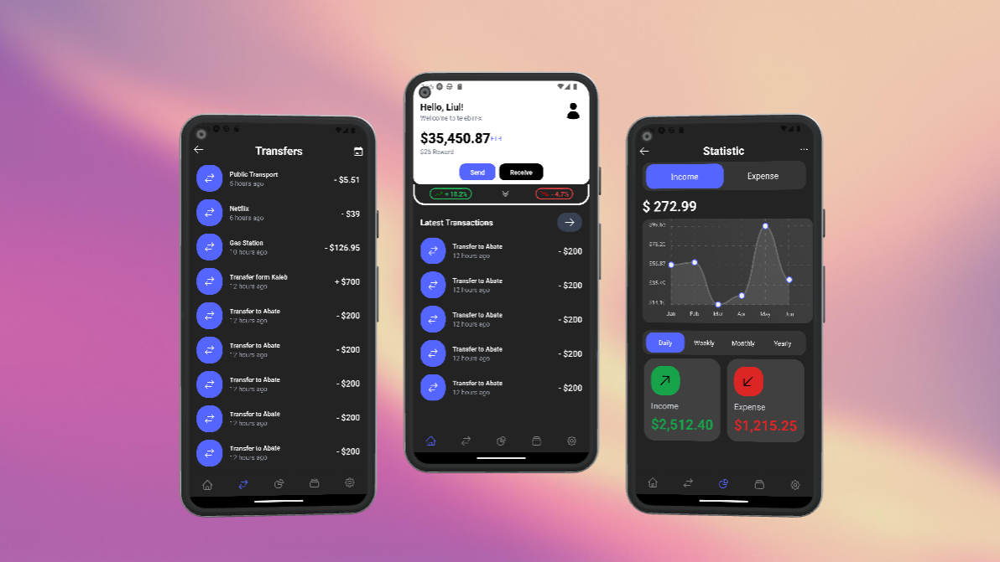

  

<h1 align="center">telebirr-x</h1>

  <strong>React Native mockup of a telebirr client app 📱</strong>

---

## Note

telebirr-x lacks full implementation as a public API for telebirr is not yet available

## How to run locally

### Prerequisites

- [nodejs](https://nodejs.org/en/)

1. Clone the repository
1. Run `yarn`
1. Run `yarn start` on the root directory

